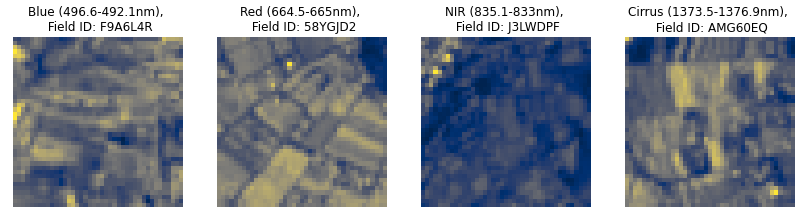
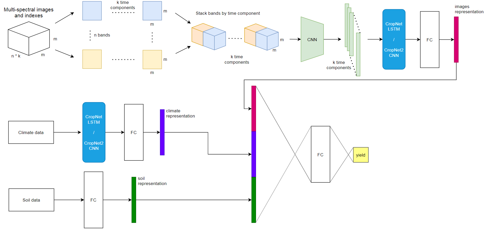

# Crop Yield Prediction

Repository contains a solution for [CGIAR Crop Yield Prediction Challenge](https://zindi.africa/competitions/cgiar-crop-yield-prediction-challenge).

Models utilize satellite multi-spectral images, climate and soil data for fields and predict crop yield in tons per acre.  
There are 2 models that differ in sequential data processing approach:
1. CropNet - processes sequential data with LSTM.
2. CropNet2 - processes sequential data with CNN.
 
Scematic models arcitecture is repsesented in the figure below: 

## Examples:
* [Dataloader usage examples](https://github.com/kumgleb/CGIAR-Crop-Yield-Prediction-Challenge/blob/master/examples/Dataloader.ipynb)
* [Model training examples](https://github.com/kumgleb/CGIAR-Crop-Yield-Prediction-Challenge/blob/master/examples/Training.ipynb) 

## Data
* Data for training is provided on a copmetition page ([data](https://zindi.africa/competitions/cgiar-crop-yield-prediction-challenge/data)).
